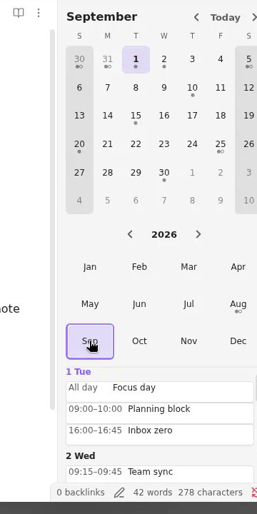

# Notebook Navigator — Calendar Agenda Fork

This is [alaning0/notebook-navigator](https://github.com/alaning0/notebook-navigator), forked from [johansan/notebook-navigator](https://github.com/johansan/notebook-navigator).

**For full documentation:** see the [upstream repo](https://github.com/johansan/notebook-navigator) and [notebooknavigator.com/docs.html](https://notebooknavigator.com/docs.html).

**Plugin ID:** `notebook-navigator` — same as upstream, so this fork can replace a Community Plugin install.

## Changes on `calendar-agenda`

This branch adds a stacked **Agenda** view beneath the right-sidebar month grid and year chips.



### Features

- **Month grid + year chips** — unchanged from upstream
- **Agenda list** — displays daily-note events for the visible month, grouped by day, showing titles and times (or "All day")
- **Event parsing** — reads list items under a `## Events` heading with Dataview-style inline fields:
  - `[startTime::]` — event start time
  - `[endTime::]` — event end time (optional)
  - `[allDay:: true]` — marks the event as all-day
- **Day filtering** — clicking a day in the month grid filters the agenda to that day (and still opens the daily note)
- **Auto-scroll to today** — when loading the full month, the agenda scrolls so today is visible (if today falls within that month)
- **Independent scroll** — the agenda scrolls independently from the calendar widgets above

## Install from this branch

```bash
# Clone and build
git clone -b calendar-agenda https://github.com/alaning0/notebook-navigator.git
cd notebook-navigator
npm ci --legacy-peer-deps --ignore-scripts
npm run build

# Copy to your vault
cp main.js manifest.json styles.css <your-vault>/.obsidian/plugins/notebook-navigator/
```

**Disable auto-update** for this plugin in Obsidian settings so Community Plugin updates don't overwrite it.

## License

GNU General Public License v3.0 — see [LICENSE](LICENSE).
